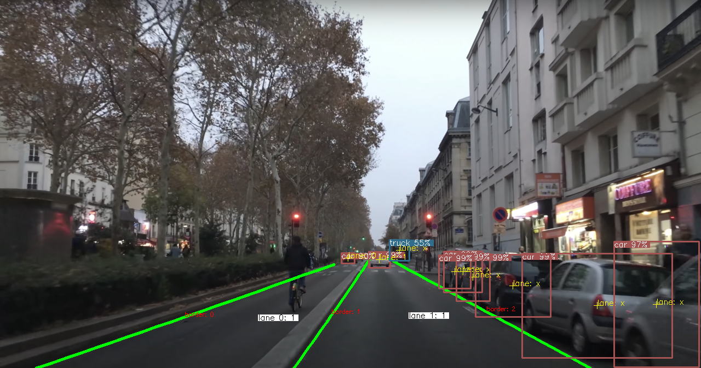

## About The Project
The main objective is to build an end-to-end pipeline for jointly detecting cars and lane divisions. 
The approaches exploit pre-trained-deep-learning-SotA models, concretely, YOLOv3 for car detection, 
and LaneATT for lane divisions.
This repository additionally performs statistics on the number of cars on separate lanes.

## Getting Started

### Prerequisites
- Python >= 3.5
- Pytorch == 1.6, torchvision == 0.7, cudatoolkit == 9.2
- CUDA to compile NMS code in lane detectors 
- Other dependencies found in environment.yml 

### Installation
Conda is necessary for the installation, which might take several minutes.

```bash
conda env create -f environment.yml
conda activate carlane
cd lane_detector/lib/nms; python setup.py install; cd -
```

Download weights of pre-trained models.
```bash
batch download_weights.sh
```

## Usage
The codes will automatically create the **output** directory. The detection results include lane 
divisions and its borders, car detection and its accuracies, a lane number to which a car belongs (**X** is annotated if cars are on
parking or can not detect lanes for cars), number of cars per lane.



##### Images:
```bash
python main.py -m image -dp data/images
```

##### Video:
```bash
python main.py -m video -dp data/video.mov --fps 20
```

## License

Distributed under the MIT License. See `LICENSE` for more information.

## Contact

Khoa NGUYEN - [@v18nguyen](https://www.linkedin.com/in/khoa-nguyen-139b9b15b/) - khoa.v18nguyen@gmail.com

## Acknowledgements
* [YOLOv3 Pytorch](https://github.com/eriklindernoren/PyTorch-YOLOv3)
* [LaneATT on CULane](https://github.com/lucastabelini/LaneATT)